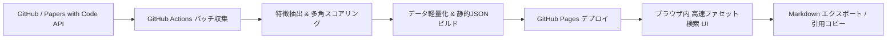

# ScholarRepo-Finder 🔍📚
> **学術研究・アルゴリズム検証用OSS特化型 検索・探索エンジン (GitHub Pages & Markdown エクスポート対応)**

[English](./README.md) | [日本語](./README.ja.md)

[](https://xzyozi.github.io/ScholarRepo-Finder/)
[](https://github.com/xzyozi/ScholarRepo-Finder/actions/workflows/ci.yml)
[](https://www.python.org/)
[](./LICENSE)

🌐 **Webサイト (Live Demo)**: [https://xzyozi.github.io/ScholarRepo-Finder/](https://xzyozi.github.io/ScholarRepo-Finder/)

ScholarRepo-Finder は、GitHub の膨大なリポジトリ群から **「学術的文脈を持つ」「堅牢な構造を持つ」「信頼できる開発者によって作成された」** シミュレーションおよびアルゴリズム検証用 OSS を自動抽出し、**GitHub Pages 上で完全無料・保守フリー・ゼロインフラで高速検索し、Markdown形式でワンクリック出力できる静的Webプラットフォーム** です。

---

## 🌟 主な特徴

- **完全サーバーレス・ゼロインフラ**: 外部データベースや常時稼働サーバーを全廃。GitHub Actions による定期自動クロール＆ビルドと、GitHub Pages による静的配信で完全完結。
- **データ厳選・超軽量設計**: 高スコア（厳選基準クリア）のリポジトリのみをインデックス化。データ容量を数MB以内に抑え、ブラウザ上での瞬時ロードを実現。
- **多角的スコアリング**: スター数に依存せず、ディレクトリ構造（`src/`, `tests/` 分離）、科学計算・OR系依存パッケージ、論文リンク（DOI, arXiv）、著者所属ドメインを総合評価。
- **爆速クライアント検索**: ブラウザ内のインメモリ検索エンジン（MiniSearch）により、言語・スコア・論文有無でのファセット絞り込みが待ち時間ゼロ（0ms）で動作。
- **Markdown ワンクリック出力**: 絞り込んだ検索結果を一括で Markdown ファイル（`.md`）としてダウンロード、または個別カードを Markdown 引用形式でクリップボードへコピー可能（Obsidian, Notion, 論文執筆ノートにそのまま活用可能）。

---

## 📐 アーキテクチャ概要



詳細な設計については以下をご参照ください：
- 📘 [基本設計書 (SRF-BD-001)](./docs/design/SRF-BD-001_基本設計書.md)
- 📊 [データ構造・状態設計書 (SRF-DS-001)](./docs/design/SRF-DS-001_データ構造仕様書.md)
- ⚙️ [詳細設計書 (SRF-DD-001)](./docs/design/SRF-DD-001_詳細設計書.md)

---

## 🚀 クイックスタート

### 前提条件
- Python 3.10 以上
- [uv](https://github.com/astral-sh/uv) (推奨パッケージマネージャー)

### インストール & 開発
```bash
# 依存パッケージの同期
uv sync

# パイプラインのローカルテスト実行
uv run python -m scholarrepo_finder.pipeline

# リント・テスト実行
uv run ruff check .
uv run mypy .
uv run pytest
```

---

## 📄 ライセンス
本プロジェクトは [MIT License](./LICENSE) のもとで公開されています。
