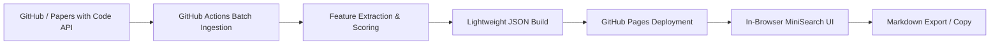

# ScholarRepo-Finder 🔍📚
> **Specialized Search & Discovery Engine for Academic Research and Algorithm Verification OSS (GitHub Pages & Markdown Export)**

[English](./README.md) | [日本語](./README.ja.md)

[](https://xzyozi.github.io/ScholarRepo-Finder/)
[](https://github.com/xzyozi/ScholarRepo-Finder/actions/workflows/ci.yml)
[](https://www.python.org/)
[](./LICENSE)

🌐 **Live Demo Website**: [https://xzyozi.github.io/ScholarRepo-Finder/](https://xzyozi.github.io/ScholarRepo-Finder/)

ScholarRepo-Finder is a static web platform that automatically discovers, rigorously evaluates, and indexes academic simulation and algorithm verification open-source software (OSS) from GitHub. It operates with **zero infrastructure, 100% free hosting via GitHub Pages, blazing-fast client-side search, and one-click Markdown export**.

---

## 🌟 Key Features

- **100% Serverless & Zero-Infra**: No external databases or always-on servers. Automated periodic crawling & indexing via GitHub Actions, statically hosted on GitHub Pages.
- **Curated & Ultra-Lightweight**: Only high-scoring repositories (Score >= 60.0) are indexed, keeping data size within a few MBs for instant in-browser loading.
- **Multi-Factor Academic Scoring**: A commentable TOML profile prioritizes reusable delivery forms, public APIs, module boundaries, usage documentation, and reproducible score evidence.
- **Instant Client-Side Search**: In-memory search (MiniSearch) enables 0ms facet filtering by language, minimum score, and paper presence.
- **One-Click Markdown Export**: Download filtered results as a Markdown summary table or copy individual repo citations directly to clipboard (ideal for Obsidian, Notion, and research notes).

---

## 📐 Architecture



For detailed design documentation:
- 📘 [Basic Design Specification (SRF-BD-001)](./docs/design/SRF-BD-001_基本設計書.md)
- 📊 [Data Structure & State Specification (SRF-DS-001)](./docs/design/SRF-DS-001_データ構造仕様書.md)
- ⚙️ [Detailed Design Specification (SRF-DD-001)](./docs/design/SRF-DD-001_詳細設計書.md)

---

## 🚀 Quick Start

### Prerequisites
- Python 3.11+
- [uv](https://github.com/astral-sh/uv) (Recommended)

### Development
```bash
# Sync dependencies
uv sync

# Run pipeline locally
uv run python -m scholarrepo_finder.pipeline

# Run tests
uv run pytest
```

---

## 📄 License
Released under the [MIT License](./LICENSE).
