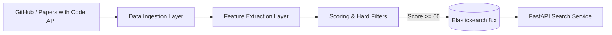

# ScholarRepo-Finder 🔍📚
> **学術研究・アルゴリズム検証用OSS特化型 検索・探索エンジン**

[](https://github.com/xzyozi/ScholarRepo-Finder/actions/workflows/ci.yml)
[](https://www.python.org/)
[](./LICENSE)

ScholarRepo-Finder は、GitHub の膨大なリポジトリ群から **「学術的文脈を持つ」「堅牢な構造を持つ」「信頼できる開発者によって作成された」** シミュレーションおよびアルゴリズム検証用 OSS を自動抽出し、ノイズを排除した純度の高い検索インデックスを構築・提供するシステムです。

---

## 🌟 主な特徴

- **多角的スコアリング**: スター数に依存せず、ディレクトリ構造（`src/`, `tests/` 分離）、科学計算・OR系依存パッケージ、論文リンク（DOI, arXiv）、Papers with Code 連携状況を総合評価。
- **著者プロファイリング**: 研究機関ドメイン（`.edu`/`.ac`）や活動実績に基づく信頼度乗数（User Trust Multiplier）を算出し、入門カリキュラム課題等の量産ノイズを自動排除。
- **効率的クローリング**: GitHub API Rate Limit に対する Token Rotation および ETag（`304 Not Modified`）差分クロールによる API 消費の最小化。
- **高速ファセット検索 API**: Elasticsearch 8.x + FastAPI による、言語・スコア・論文有無での柔軟な絞り込み。

---

## 📐 アーキテクチャ概要



詳細な設計については以下をご参照ください：
- 📘 [基本設計書 (SRF-BD-001)](./docs/design/SRF-BD-001_基本設計書.md)
- 📊 [データ構造・状態設計書 (SRF-DS-001)](./docs/design/SRF-DS-001_データ構造仕様書.md)
- ⚙️ [詳細設計書 (SRF-DD-001)](./docs/design/SRF-DD-001_詳細設計書.md)

---

## 🚀 クイックスタート

### 前提条件
- Python 3.10 以上
- [uv](https://github.com/astral-sh/uv) (推奨パッケージマネージャー)
- Docker & Docker Compose (Elasticsearch, Redis 起動用)

### インストール
```bash
# 依存パッケージの同期
uv sync
```

### 開発・テスト
```bash
# リント・フォーマットチェック
uv run ruff check .

# 型チェック
uv run mypy .

# テスト実行
uv run pytest
```

---

## 📄 ライセンス
本プロジェクトは [MIT License](./LICENSE) のもとで公開されています。
