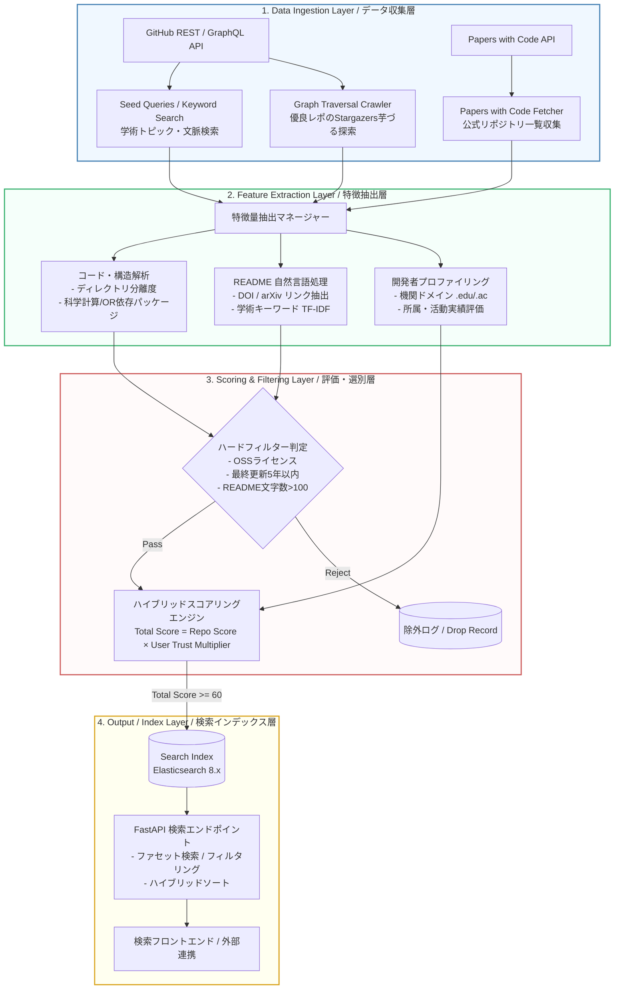

# 基本設計書（基本仕様・システム全体アーキテクチャ定義）
**学術研究・アルゴリズム検証用OSS特化型 検索モジュール (ScholarRepo-Finder)**

| 項目 | 内容 |
| :--- | :--- |
| 文書番号 | SRF-BD-001 |
| ドキュメント名 | 学術研究・アルゴリズム検証用OSS特化型検索モジュール 基本設計書 |
| 版数 | Rev.1.0 (新規作成) |
| 改訂日 | 2026-08-31 |
| 作成日 | 2026-08-31 |
| 作成者 | ScholarRepo-Finder 開発チーム |

---

## 1. 概要と基本方針

### 1.1 システム目的と対象範囲

#### 背景と課題
GitHub上には数千万の公開リポジトリが存在するが、その多くは入門チュートリアル、未完成の個人的な実験コード、または実用性を欠くプロトタイプである。
オペレーションズ・リサーチ（OR）、配車最適化（VRP）、マルチエージェント・シミュレーション、経路計画等の学術研究・実用開発において「比較評価用のベースライン」「再現実験用OSS」として耐えうる高品質なOSSを探索する際、従来のスター数偏重な標準検索では大量のノイズが混入し、研究者・エンジニアの探索コストが著しく増大している。

#### システムの目的
本システム（**ScholarRepo-Finder**）は、GitHub等の公開リポジトリ群から**「学術的文脈を持つ」「堅牢な構造を持つ」「信頼できる開発者によって作成された」**シミュレーションおよびアルゴリズム検証用OSSを自動抽出し、ノイズを排除した純度の高い検索インデックスを構築・提供することを目的とする。

#### 対象システムスコープ
1. **データ収集バッチ (Data Ingestion Layer)**: GitHub REST/GraphQL API および Papers with Code API からの継続的・網羅的シード収集
2. **特徴抽出パイプライン (Feature Extraction Layer)**: コード構造解析、READMEの自然言語処理（NLP）、開発者プロファイリング
3. **スコアリング＆フィルタリングエンジン (Scoring & Filtering Layer)**: ハードフィルターによるノイズ排除と、品質×信頼度のハイブリッドスコア算出
4. **検索API・インデックス基盤 (Output / Index Layer)**: Elasticsearch をバックエンドとするファセット検索API

### 1.2 アーキテクチャ基本原則と課題解決

| 課題・ボトルネック | 解決方針・選定技術 | 担当コンポーネント |
| :--- | :--- | :--- |
| **スター数偏重とノイズ混入** スター数が少なくても論文実装として優れたOSSが埋もれる | コード構造（`src/`, `tests/` 分離や科学計算依存関係）と学術文脈（DOI, arXiv, Papers with Code連携）による多角的スコアリング | 特徴抽出マネージャー / スコアリングエンジン |
| **学習用・課題レポの混入** 初心者カリキュラム課題等の量産レポが上位に来る | ハードフィルター（README文字数・ライセンス等）＋ 開発者プロファイリングによるノイズ乗数制御 | ハードフィルター判定 / 開発者プロファイラー |
| **GitHub API Rate Limit の枯渇** GitHub APIの5,000 req/h 制限による収集停止 | Token Rotation（複数PAT切り替え）＋ ETag（`304 Not Modified`）による差分フェッチ | データ収集ワーカー |
| **検索応答速度と適合性の両立** | BM25全文検索テキストスコアと独自品質スコア（Total Score）を組み合わせたハイブリッドクエリ | 検索インデックス (Elasticsearch) / 検索API |

---

## 2. システム全体アーキテクチャとコンポーネント分離

### 2.1 全体構造とデータフロー (Mermaid アーキテクチャ図)

システムは4つの疎結合なレイヤーから構成され、非同期ジョブキュー（Celery + Redis）を介してパイプライン処理を実行する。

### 2.2 コンポーネント責務マッピング

| # | レイヤー | コンポーネント名 | 担当領域・主要責務 | 関連詳細設計書名 |
| :--- | :--- | :--- | :--- | :--- |
| 1 | Data Ingestion | `SeedCrawler` | トピック検索・キーワード検索によるシードリポジトリURLの収集 | [SRF-DD-001_詳細設計書.md](./SRF-DD-001_詳細設計書.md) |
| 2 | Data Ingestion | `PapersWithCodeCollector` | Papers with Code API から学術タスクに紐づく公式リポジトリの定期取得 | [SRF-DD-001_詳細設計書.md](./SRF-DD-001_詳細設計書.md) |
| 3 | Data Ingestion | `GraphTraversalCrawler` | 高スコア（80点以上）リポジトリのStargazersを起点とした協調探索 | [SRF-DD-001_詳細設計書.md](./SRF-DD-001_詳細設計書.md) |
| 4 | Feature Extraction | `StructureAnalyzer` | リポジトリ構造（`src/`, `tests/` 分離）および依存ファイル（`pyproject.toml`, `requirements.txt`, `Cargo.toml`等）の解析 | [SRF-DD-001_詳細設計書.md](./SRF-DD-001_詳細設計書.md) |
| 5 | Feature Extraction | `NLPAnalyzer` | README のテキスト解析、DOI/arXiv 正規表現マッチング、学術重要語のTF-IDF算出 | [SRF-DD-001_詳細設計書.md](./SRF-DD-001_詳細設計書.md) |
| 6 | Feature Extraction | `UserProfiler` | リポジトリ所有者の組織所属、メールドメイン（`.edu`/`.ac`）、活動履歴の解析 | [SRF-DD-001_詳細設計書.md](./SRF-DD-001_詳細設計書.md) |
| 7 | Scoring & Filtering | `HardFilter` | ライセンス有無、最終更新年、README文字数等の必須品質ゲート判定 | [SRF-DS-001_データ構造仕様書.md](./SRF-DS-001_データ構造仕様書.md) |
| 8 | Scoring & Filtering | `ScoringEngine` | 構造スコア・文脈スコア・著者信頼度乗数の合算・閾値（>=60）判定 | [SRF-DS-001_データ構造仕様書.md](./SRF-DS-001_データ構造仕様書.md) |
| 9 | Output / Index | `SearchIndexer` | スコアリング済みドキュメントのElasticsearchへの登録・更新 | [SRF-DD-001_詳細設計書.md](./SRF-DD-001_詳細設計書.md) |
| 10 | Output / Index | `SearchAPI` | FastAPI によるファセット検索エンドポイント（言語別、最小スコア、論文有無等）の提供 | [SRF-DD-001_詳細設計書.md](./SRF-DD-001_詳細設計書.md) |

---

## 3. 動作前提およびシステム境界

### 3.1 実行前提環境
- **対応OS**: Linux (Ubuntu 22.04 LTS 推奨) / macOS / Windows 11 (WSL2 / Native)
- **ランタイム要件**: Python 3.10 以上（パッケージマネージャー: `uv`）
- **外部依存ツール・ミドルウェア**:
  - **Elasticsearch 8.x** (または OpenSearch 2.x): 全文検索・カスタムスコアインデックス
  - **Redis 7.x**: Celery タスクキュー・レートリミット分散ロック・ETagキャッシュ
  - **GitHub API**: REST API v3 / GraphQL API v4 (Personal Access Token 必要)
  - **Papers with Code API**: 公開REST API

### 3.2 安全回路・システム境界方針
- **タイムアウトと再試行制御**:
  - GitHub API 呼び出しは 15 秒でタイムアウト。指数バックオフ付きリトライ（最大 3 回）。
  - API Rate Limit 到達時は Token Pool 内の別 PAT に即時ローテーション。全滅時は Reset 時刻まで待機。
- **排他制御・競合防止**:
  - 同一リポジトリの多重クロール防止のため、Redis 分散ロックキー（TTL: 300秒）による排他制御を実施。
- **失敗時保全契約 (Fault Tolerance)**:
  - 特徴抽出失敗時は対象リポジトリをエラーログに記録し、パイプライン全体を停止させずに次タスクを継続処理。
  - ETag による差分判定（`304 Not Modified`）を活用し、未変更リポジトリの不要な再計算と API 浪費を遮断。

---

## 4. 基本設計における変更管理方針
- **拡張時のルール**: 新規の特徴抽出器を追加する場合は `FeatureExtractor` 基底インターフェースを実装し、[SRF-DS-001_データ構造仕様書.md](./SRF-DS-001_データ構造仕様書.md) のスコアリングテーブルに係数を定義することで疎結合に追加可能とする。
- **仕様の決定権 (SSOT)**: システム全体構造・基本方針は本書を正本とし、具象データモデル・スキーマは [SRF-DS-001_データ構造仕様書.md](./SRF-DS-001_データ構造仕様書.md)、内部処理フロー・具象 DTO は [SRF-DD-001_詳細設計書.md](./SRF-DD-001_詳細設計書.md) を正本とする。

---

## 5. 改訂履歴 (Change Log)

| 版数 | 改訂日 | 変更者 | 変更内容・変更理由 (Why) |
| :--- | :--- | :--- | :--- |
| Rev.1.0 | 2026-08-31 | ScholarRepo-Finder 開発チーム | 新規作成（初版制定 / 設計ガイドライン命名規則準拠） |
