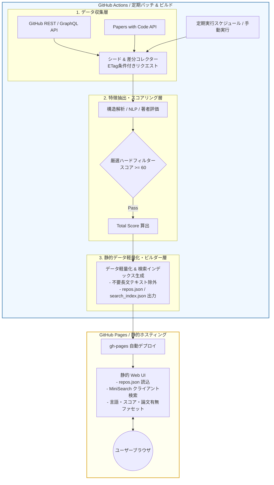

# 基本設計書（基本仕様・GitHub Pages完結型アーキテクチャ定義）
**学術研究・アルゴリズム検証用OSS特化型 検索モジュール (ScholarRepo-Finder)**

| 項目 | 内容 |
| :--- | :--- |
| 文書番号 | SRF-BD-001 |
| ドキュメント名 | 学術研究・アルゴリズム検証用OSS特化型検索モジュール 基本設計書 |
| 版数 | Rev.1.1 (GitHub Pages完結・データ軽量化対応) |
| 改訂日 | 2026-08-31 |
| 作成日 | 2026-08-31 |
| 作成者 | ScholarRepo-Finder 開発チーム |

---

## 1. 概要と基本方針

### 1.1 システム目的と対象範囲

#### 背景と課題
GitHub上には膨大な公開リポジトリが存在するが、その多くは入門チュートリアルや個人的な実験コードであり、学術研究（OR、配車最適化、シミュレーション等）の比較ベースラインとして耐えうる高品質なOSSを探索する際のノイズとなっている。

#### システムの目的
本システム（**ScholarRepo-Finder**）は、GitHub等の公開リポジトリ群から**「学術的文脈を持つ」「堅牢な構造を持つ」「信頼できる開発者によって作成された」**優良OSSのみを厳選・抽出し、**GitHub Pages 上で完全無料・保守フリー・高速に検索できる軽量な静的Webプラットフォーム**を構築・提供する。

#### 対象システムスコープ
1. **データ収集・評価パイプライン (GitHub Actions)**: 定期実行バッチにより候補リポジトリを収集・解析・スコアリング
2. **データ軽量化＆インデックス生成 (Static Builder)**: スコア上位の優良リポジトリのみを抽出し、検索用軽量JSON（数MB以内）を生成
3. **静的検索Webプラットフォーム (GitHub Pages)**: クライアントサイド検索ライブラリ（MiniSearch等）を用いた即時ファセット検索UI

### 1.2 アーキテクチャ基本原則と課題解決

| 課題・ボトルネック | 解決方針・選定技術 | 担当コンポーネント |
| :--- | :--- | :--- |
| **サーバー維持費・DB運用負担** 常時稼働サーバーのコスト・障害対応 | 外部DB/サーバーを全廃し、GitHub Actions + GitHub Pages のみで完結 | GitHub Actions / GitHub Pages |
| **データ容量増大と読込遅延** 大量データのブラウザ読み込み負荷 | 高スコア（厳選閾値）のみをインデックス化し、フィールドを最小限に軽量圧縮（全体数MB以下） | スコアリング / 静的データビルダー |
| **API Rate Limit の制約** GitHub APIの回数制限 | ETag（`304 Not Modified`）差分クロールによる API 消費の最小化 | データ収集ワーカー |
| **検索応答速度の向上** | クライアントサイド（ブラウザ内）でのインメモリ全文検索・ファセット絞り込み（応答0ms） | GitHub Pages Web UI (MiniSearch) |

---

## 2. システム全体アーキテクチャとコンポーネント分離

### 2.1 全体構造とデータフロー (Mermaid アーキテクチャ図)

本システムは、**「GitHub Actions によるデータ生成」** と **「GitHub Pages による静的配信」** の2大コンポーネントで完結する。

### 2.2 コンポーネント責務マッピング

| # | レイヤー | コンポーネント名 | 担当領域・主要責務 | 関連詳細設計書名 |
| :--- | :--- | :--- | :--- | :--- |
| 1 | Ingestion | `RepoCollector` | GitHub/Papers with Code API からのシード検索および ETag 差分フェッチ | [SRF-DD-001_詳細設計書.md](./SRF-DD-001_詳細設計書.md) |
| 2 | Extraction | `FeatureExtractor` | ディレクトリ構造、科学計算依存関係、DOI/arXiv リンク、著者情報の抽出 | [SRF-DD-001_詳細設計書.md](./SRF-DD-001_詳細設計書.md) |
| 3 | Scoring | `QualityEvaluator` | ハードフィルター判定および品質×信頼度スコア（Total Score）の算出 | [SRF-DS-001_データ構造仕様書.md](./SRF-DS-001_データ構造仕様書.md) |
| 4 | Build | `StaticDataBuilder` | 配信に必要な最小フィールドへの圧縮、軽量 JSON および検索インデックスのビルド | [SRF-DS-001_データ構造仕様書.md](./SRF-DS-001_データ構造仕様書.md) |
| 5 | Web UI | `ClientSearchApp` | GitHub Pages 上で動作する静的 UI。高速クライアントサイド検索・ファセット絞り込み | [SRF-DD-001_詳細設計書.md](./SRF-DD-001_詳細設計書.md) |

---

## 3. 動作前提およびシステム境界

### 3.1 実行前提環境
- **インフラ要件**: GitHub Actions（Ubuntu Runner）および GitHub Pages
- **言語・ツール**: Python 3.10 以上（パッケージマネージャー: `uv`）
- **Web UI 技術**: HTML5, Modern JavaScript / TypeScript, CSS3 (Tailwind CSS 等), [MiniSearch](https://github.com/lucaong/minisearch)

### 3.2 データ量抑制および安全境界方針
- **データ厳選基準**:
  - スコア 60 点以上のみをインデックス対象とし、ノイズ混入とデータ肥大化を根本から遮断。
  - 公開配信 JSON には README 全文を含めず、タイトル・概要・タグ・スコア・論文リンク等のメタデータのみにスリム化（1件あたり約 0.5 KB）。
  - 合計データ容量を **1〜5 MB 程度** に抑え、モバイル環境でも即時ロード可能とする。
- **GitHub Pages 容量・転送量遵守**:
  - GitHub Pages の上限（1 GB容量、月100 GB転送量）に対し、本システムは数％未満のフットプリントで運用。

---

## 4. 基本設計における変更管理方針
- **仕様の決定権 (SSOT)**: システム全体構造・基本方針は本書を正本とし、具象データモデル・スキーマは [SRF-DS-001_データ構造仕様書.md](./SRF-DS-001_データ構造仕様書.md)、内部処理フロー・具象 DTO は [SRF-DD-001_詳細設計書.md](./SRF-DD-001_詳細設計書.md) を正本とする。

---

## 5. 改訂履歴 (Change Log)

| 版数 | 改訂日 | 変更者 | 変更内容・変更理由 (Why) |
| :--- | :--- | :--- | :--- |
| Rev.1.0 | 2026-08-31 | ScholarRepo-Finder 開発チーム | 新規作成（初版制定） |
| Rev.1.1 | 2026-08-31 | ScholarRepo-Finder 開発チーム | GitHub Pages 完結型アーキテクチャへの全面移行およびデータ量抑制方針の反映 |
