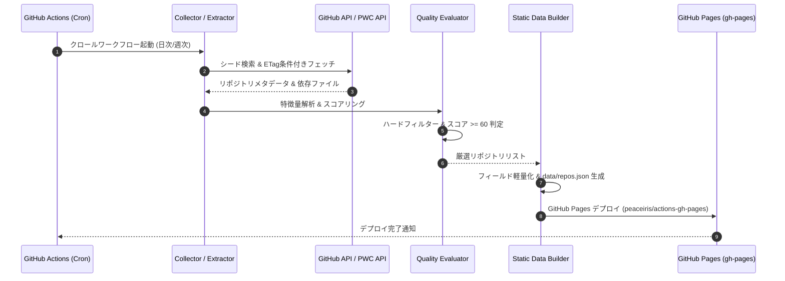
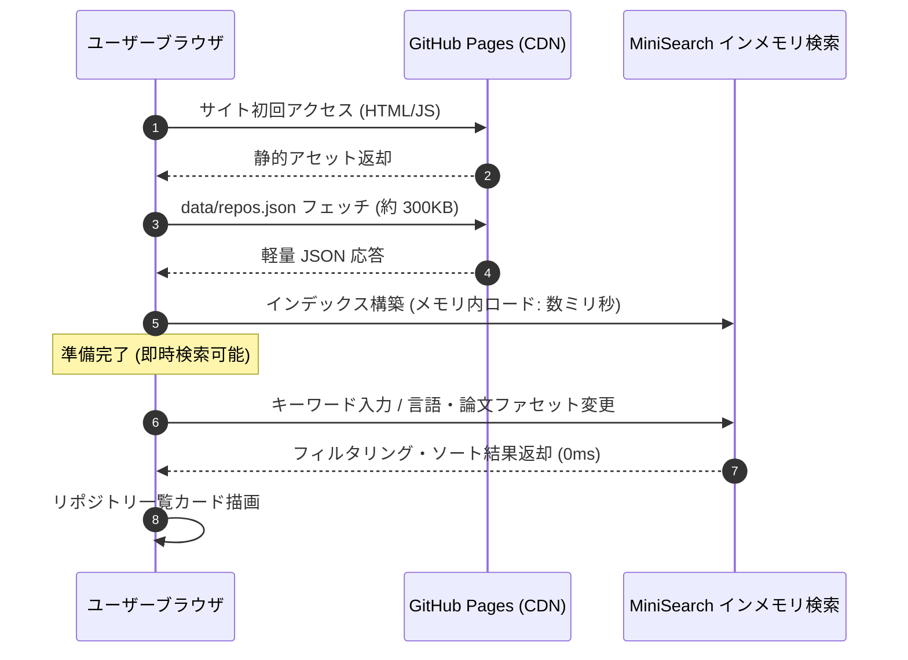

# 詳細設計書（機能・モジュール制御仕様）
**ScholarRepo-Finder GitHub Actions バッチ & Pages クライアント検索仕様**

| 項目 | 内容 |
| :--- | :--- |
| 文書番号 | SRF-DD-001 |
| ドキュメント名 | 学術研究・アルゴリズム検証用OSS特化型検索モジュール 詳細設計書 |
| 版数 | Rev.1.1 (GitHub Actions & Pages クライアント制御) |
| 改訂日 | 2026-08-31 |
| 作成日 | 2026-08-31 |
| 作成者 | ScholarRepo-Finder 開発チーム |

---

## 1. 概要とSSOT境界

### 1.1 モジュールの目的
本書は、以下の3大コンポーネントの具象ロジック、データパッシング、エラーハンドリング、およびシーケンス制御を規定する：
1. **`pipeline` (GitHub Actions クロール＆スコアリングバッチ)**
2. **`builder` (静的 JSON & 検索インデックス生成モジュール)**
3. **`client` (GitHub Pages クライアントサイド検索 Web UI)**

### 1.2 単一責任範囲 (SSOT) とデータ境界
- **モジュール制御正本 (SSOT)**: 本書はバッチ実行ステップ、静的ビルド手順、クライアント側検索制御の正本とする。
- **データ境界 (DTO vs DAO)**: 本書は内部パッシング DTO を定義し、配信用静的 JSON 仕様は [SRF-DS-001_データ構造仕様書.md](./SRF-DS-001_データ構造仕様書.md) を正本とする。

---

## 2. 処理シーケンス・パイプラインフロー (Mermaid 図)

### 2.1 GitHub Actions 定期実行＆デプロイフロー

### 2.2 クライアントサイド検索フロー (ブラウザ内動作)

---

## 3. GitHub Actions ワークフロー仕様

### 3.1 ワークフロー定義 (`.github/workflows/crawl-and-deploy.yml`)
- **トリガー**:
  - `schedule`: 毎週月曜 00:00 (UTC)
  - `workflow_dispatch`: 手動実行
- **実行ステップ**:
  1. リポジトリのチェックアウト
  2. Python & `uv` 環境セットアップ
  3. クローラー＆スコアリング実行 (`uv run python -m src.pipeline`)
  4. 静的 JSON 生成 (`uv run python -m src.builder`)
  5. 静的サイトビルド & GitHub Pages デプロイ (`actions/deploy-pages`)

---

## 4. クライアントサイド検索 UI 仕様

### 4.1 検索・絞り込み機能要件
1. **フリーワード全文検索**: リポジトリ名、説明文、トピックを対象としたインクリメンタル検索（MiniSearch）
2. **ファセットフィルター**:
   - プログラミング言語（Python, C, C++, Rust, Java, etc.）
   - 論文リンク（DOI / arXiv）の有無
   - アカデミック著者（`.edu`/`.ac`）限定
   - 最低スコアフィルター（例: 60点以上、80点以上）
3. **ソート機能**:
   - 総合スコア順（デフォルト降順）
   - スター数順
   - 最終更新日順

---

## 5. エラーハンドリング・障害対策

| エラー種別 | 発生条件 | 対処方針 |
| :--- | :--- | :--- |
| `API Rate Limit` | GitHub API 制限到達 | ETagキャッシュを優先し、残存リクエスト枯渇時は現在取得分までで安全にビルドを完了 |
| `Invalid Data` | 外部APIの構文破損 | 該当リポジトリのみスキップし、パイプライン全体の中断を防止 |
| `Deploy Failure` | Pages デプロイエラー | 前回の公開静的データがそのまま保持されるため、サイト停止は発生しない |

---

## 6. 改訂履歴 (Change Log)

| 版数 | 改訂日 | 変更者 | 変更内容・変更理由 (Why) |
| :--- | :--- | :--- | :--- |
| Rev.1.0 | 2026-08-31 | ScholarRepo-Finder 開発チーム | 新規作成（初版制定） |
| Rev.1.1 | 2026-08-31 | ScholarRepo-Finder 開発チーム | GitHub Actions & Pages クライアント検索仕様への移行 |
