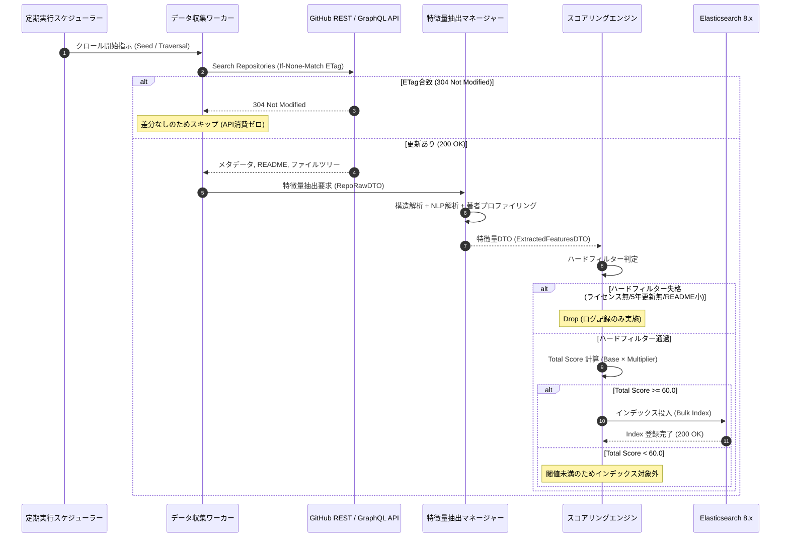

# 詳細設計書（機能・モジュール制御仕様）
**ScholarRepo-Finder モジュール制御・パイプライン・API仕様**

| 項目 | 内容 |
| :--- | :--- |
| 文書番号 | SRF-DD-001 |
| ドキュメント名 | 学術研究・アルゴリズム検証用OSS特化型検索モジュール 詳細設計書 |
| 版数 | Rev.1.0 (新規作成) |
| 改訂日 | 2026-08-31 |
| 作成日 | 2026-08-31 |
| 作成者 | ScholarRepo-Finder 開発チーム |

---

## 1. 概要とSSOT境界

### 1.1 モジュールの目的
本書は、以下の4大モジュールの具象ロジック、データパッシングDTO、例外ハンドリング、およびシーケンス制御を規定する：
1. **`crawler`**: データ収集モジュール（GitHub / Papers with Code クローラー）
2. **`extractor`**: 特徴抽出モジュール（コード構造・NLP・開発者プロファイリング）
3. **`scoring`**: 評価・選別モジュール（ハードフィルター判定・スコアリング算出）
4. **`api`**: 検索配信モジュール（FastAPI 検索エンドポイント）

### 1.2 単一責任範囲 (SSOT) とデータ境界
- **モジュール制御正本 (SSOT)**: 本書は関数の呼び出し順序、制御フロー、状態遷移ルーティング、エラー対処契約の正本とする。
- **データ境界 (DTO vs DAO)**: 本書はモジュール間パッシングで使用される DTO (Data Transfer Object) スキーマを管理する。物理ストレージ構造 (DAO / State正本) については [SRF-DS-001_データ構造仕様書.md](./SRF-DS-001_データ構造仕様書.md) を参照する。

---

## 2. インターフェースと DTO (Data Transfer Object) 仕様

### 2.1 主要機能・関数の役割と契約

| モジュール | 関数 / メソッド識別名 | 事前条件 (Pre-conditions) | 事後条件 (Post-conditions) |
| :--- | :--- | :--- | :--- |
| `crawler` | `fetch_repository_metadata(repo_id, etag)` | 有効なGitHub PATが存在すること | `RepoRawDTO` または `NotModified` を返却 |
| `extractor` | `extract_all_features(raw_dto)` | `RepoRawDTO` が有効であること | `ExtractedFeaturesDTO` を返却 |
| `scoring` | `evaluate_and_score(features_dto, raw_dto)` | `ExtractedFeaturesDTO` が入力されること | `ScoreResultDTO` を返却 |
| `api` | `search_repositories(query_params)` | Elasticsearch 接続が正常であること | `SearchResponseDTO` を返却 |

### 2.2 DTO スキーマ・パラメータ仕様

#### ① 収集生データ DTO (`RepoRawDTO`)

| フィールド名 | データ型 | 必須性 | デフォルト値 | バリデーションルール・制約 |
| :--- | :--- | :---: | :--- | :--- |
| `repo_id` | 文字列 | 必須 | なし | `[a-zA-Z0-9_-]+/[a-zA-Z0-9_.-]+` 形式 |
| `name` | 文字列 | 必須 | なし | 1文字以上 100文字以下 |
| `owner` | 文字列 | 必須 | なし | GitHub ユーザー名 |
| `description` | 文字列 | 任意 | `None` | 最大 1,000文字 |
| `html_url` | 文字列 | 必須 | なし | 有効な HTTP/HTTPS URL |
| `stars` | 整数 | 必須 | `0` | $\ge 0$ |
| `forks` | 整数 | 必須 | `0` | $\ge 0$ |
| `created_at` | ISO日時 | 必須 | なし | 過去の日時 |
| `last_commit_at` | ISO日時 | 必須 | なし | 過去の日時 |
| `license_spdx` | 文字列 | 任意 | `None` | SPDX 識別文字列 |
| `primary_language` | 文字列 | 任意 | `None` | 文字列 |
| `topics` | 文字列配列 | 必須 | `[]` | 配列要素は各 50文字以下 |
| `readme_raw` | 文字列 | 任意 | `None` | 最大 500,000文字 |
| `file_tree` | 文字列配列 | 必須 | `[]` | ルートおよび第1階層パス一覧 |
| `dependency_files` | 辞書 | 必須 | `{}` | ファイル名と内容のキー・バリュー |

#### ② 特徴量抽出結果 DTO (`ExtractedFeaturesDTO`)

| フィールド名 | データ型 | 必須性 | デフォルト値 | 制約・意味 |
| :--- | :--- | :---: | :--- | :--- |
| `repo_id` | 文字列 | 必須 | なし | リポジトリ識別子 |
| `has_src_or_app_dir` | ブーリアン | 必須 | `False` | `src/` または `app/` 存在フラグ |
| `has_tests_dir` | ブーリアン | 必須 | `False` | `tests/` または `test/` 存在フラグ |
| `has_docs_dir` | ブーリアン | 必須 | `False` | `docs/` または `doc/` 存在フラグ |
| `has_ci_workflow` | ブーリアン | 必須 | `False` | CI 設定ファイル存在フラグ |
| `scientific_libs_detected` | 文字列配列 | 必須 | `[]` | 検出された科学計算・ORライブラリ名 |
| `has_doi_link` | ブーリアン | 必須 | `False` | `doi.org` リンクマッチフラグ |
| `has_arxiv_link` | ブーリアン | 必須 | `False` | `arxiv.org/abs` リンクマッチフラグ |
| `is_pwc_official` | ブーリアン | 必須 | `False` | Papers with Code 公式登録フラグ |
| `academic_keyword_score` | 浮動小数点 | 必須 | `0.0` | 0.0 〜 10.0 (TF-IDF スコア) |
| `author_email_domain` | 文字列 | 任意 | `None` | メールアドレスドメイン |
| `is_edu_or_ac_domain` | ブーリアン | 必須 | `False` | `.edu`/`.ac.*`/`.gov` 判定フラグ |
| `is_verified_org` | ブーリアン | 必須 | `False` | 認証済み組織判定フラグ |
| `author_account_age_years` | 整数 | 必須 | `0` | アカウント経過年数 ($\ge 0$) |

#### ③ 評価結果 DTO (`ScoreResultDTO`)

| フィールド名 | データ型 | 必須性 | デフォルト値 | 制約・意味 |
| :--- | :--- | :---: | :--- | :--- |
| `repo_id` | 文字列 | 必須 | なし | リポジトリ識別子 |
| `hard_filter_passed` | ブーリアン | 必須 | `False` | ハードフィルター合否 |
| `reject_reason` | 文字列 | 任意 | `None` | 除外理由 (不合格時) |
| `structural_score` | 浮動小数点 | 必須 | `0.0` | 0.0 〜 50.0 点 |
| `context_score` | 浮動小数点 | 必須 | `0.0` | 0.0 〜 50.0 点 |
| `base_repo_score` | 浮動小数点 | 必須 | `0.0` | 0.0 〜 100.0 点 |
| `user_trust_multiplier` | 浮動小数点 | 必須 | `1.0` | 0.5 〜 1.5 倍 |
| `total_score` | 浮動小数点 | 必須 | `0.0` | 0.0 〜 150.0 点 |

---

## 3. 処理フロー・シーケンスロジック (Mermaid 図)

### 3.1 エンドツーエンド処理シーケンス図

### 3.2 パイプライン状態遷移ルール

| 現在の状態 / ノード | 実行結果 / 評価フラグ | 次の状態 / ノード | 遷移判定条件・閾値ルール |
| :--- | :--- | :--- | :--- |
| `Ingestion` | 200 OK (差分あり) | `FeatureExtraction` | 新規または更新されたリポジトリ |
| `Ingestion` | 304 Not Modified | `Completed (Skipped)` | ETag 一致 |
| `FeatureExtraction` | 抽出成功 | `HardFilterCheck` | 特徴量ベクトル生成完了 |
| `HardFilterCheck` | ハードフィルター失格 | `Dropped` | ライセンス無 / 最終コミット>5年 / README<=100文字 |
| `HardFilterCheck` | ハードフィルター合格 | `ScoreCalculation` | 全ハード条件クリア |
| `ScoreCalculation` | Total Score $\ge 60.0$ | `IndexInsertion` | 閾値クリア |
| `ScoreCalculation` | Total Score $< 60.0$ | `Archived (LowScore)` | 閾値未満 |

---

## 4. エラー処理・失敗契約

### 4.1 エラー分類と対処方針

| エラーカテゴリ | 発生・判定基準 | 再試行上限 | 終端ステータス | 副作用・データ保持契約 |
| :--- | :--- | :---: | :--- | :--- |
| `RateLimitExceeded` | GitHub API 403 (Rate Limit) | 3回 (Token切替) | 一時待機・再開 | 取得中タスクをキュー先頭に返却 |
| `RepositoryNotFound` | GitHub API 404 (削除/非公開) | 0回 | `Removed` | ESインデックスから論理削除 |
| `DataParsingError` | 不正文字コード・構文破損 | 0回 | `DegradedPass` | 破損項目のみデフォルト値適用し処理継続 |
| `StorageUnavailable` | Elasticsearch / Redis 接続切断 | 5回 (指数待機) | `Escalated` | パイプライン一時停止・アラート通知 |

---

## 5. テスト・検証要件

### 5.1 単体テスト・品質検証基準
- **テスト対象モジュール**:
  - `crawler`: Token Rotation 正常切替、ETag 304 スキップのモック検証
  - `extractor`: 各種ディレクトリ構造判定、DOI/arXiv 正規表現抽出の網羅検証
  - `scoring`: ハードフィルター全パターンの判定、スコア計算式の境界値検証
  - `api`: FastAPI エンドポイントのクエリバリデーションおよびレスポンス形式検証
- **品質ゲート要件**: `uv run ruff check .`, `uv run mypy .`, `uv run pytest` の全件パス

---

## 6. 改訂履歴 (Change Log)

| 版数 | 改訂日 | 変更者 | 変更内容・変更理由 (Why) |
| :--- | :--- | :--- | :--- |
| Rev.1.0 | 2026-08-31 | ScholarRepo-Finder 開発チーム | 新規作成（初版制定 / 設計ガイドライン命名規則準拠） |
