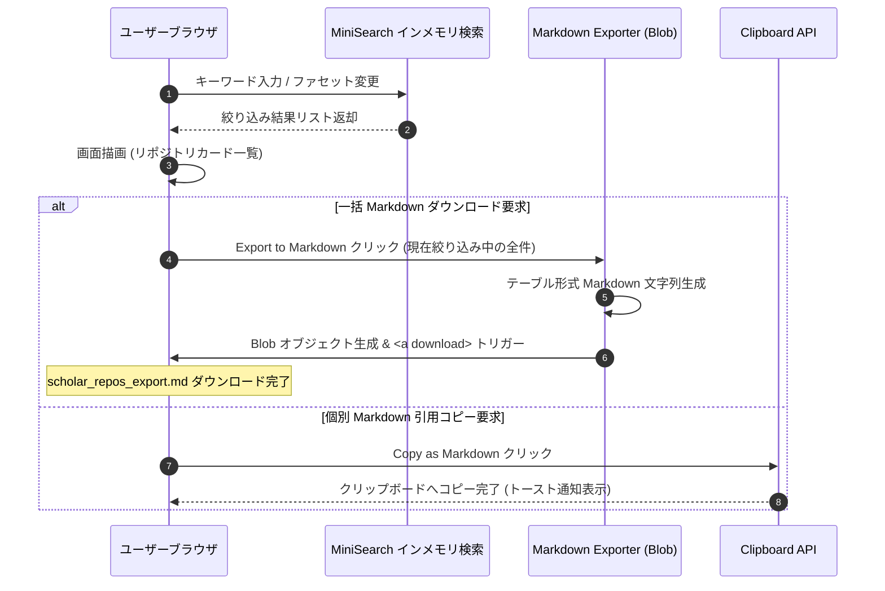

# 詳細設計書（機能・モジュール制御仕様）
**ScholarRepo-Finder GitHub Actions バッチ & Pages クライアント検索・エクスポート仕様**

| 項目           | 内容                                                           |
| :------------- | :------------------------------------------------------------- |
| 文書番号       | SRF-DD-001                                                     |
| ドキュメント名 | 学術研究・アルゴリズム検証用OSS特化型検索モジュール 詳細設計書 |
| 版数           | Rev.1.2 (Markdownエクスポート制御仕様追加)                     |
| 改訂日         | 2026-08-31                                                     |
| 作成日         | 2026-08-31                                                     |
| 作成者         | ScholarRepo-Finder 開発チーム                                  |

---

## 1. 概要とSSOT境界

### 1.1 モジュールの目的
本書は、以下の4大コンポーネントの具象ロジック、データパッシング、エラーハンドリング、およびシーケンス制御を規定する：
1. **`pipeline` (GitHub Actions クロール＆スコアリングバッチ)**
2. **`builder` (静的 JSON & サマリーMarkdown生成モジュール)**
3. **`client` (GitHub Pages クライアントサイド検索 Web UI)**
4. **`exporter` (ブラウザ内 Markdown 生成・ダウンロード制御)**

---

## 2. 処理シーケンス・パイプラインフロー (Mermaid 図)

### 2.1 クライアントサイド検索 & Markdown エクスポートフロー

### 2.2 設定駆動の関数提供型候補選定フロー（実装済み）

1. **設定検証**: 評価開始前に `config/scoring.toml` を読み込み、Python 3.11以降の標準ライブラリ `tomllib` で構文を解析する。スキーマ、未知キー、必須キー、数値範囲、評価軸の上限を検証し、失敗時は明示的なエラーで処理を停止して配信データを更新しない。
2. **シード分類**: 収集クエリとトピックを、OR、シミュレーション、数値計算、MLなどのカテゴリへ分類し、カテゴリ別の候補数を記録する。
3. **提供形態の抽出**: 言語ごとに公開APIの根拠を抽出する。例としてC/C++は公開ヘッダ、Pythonはimport可能なパッケージ、Rustは`lib.rs`、JavaScript/TypeScriptは公開exportを確認する。
4. **モジュール境界の抽出**: 実行入口とドメインロジックが分離されているか、責務別のモジュールが存在するかを確認する。
5. **設定駆動の評価**: 提供形態、公開API、モジュール分割、利用例、設定可能I/O、保守性、研究文脈を、検証済みプロファイルの配点で評価する。ML・科学計算ライブラリ数およびPapers with Codeは加点根拠に使用しない。
6. **選定と配信**: ハードフィルター通過後、設定された掲載閾値以上の候補だけを配信対象にする。
7. **観測値の出力**: 提供形態別・シードカテゴリ別に、収集数、ハードフィルター通過数、閾値通過数、最終掲載数、評価軸別内訳、設定ID・版・ハッシュを出力する。加えて、PWC照合状態、所有者照会状態・種別、組織認証、学術ドメイン、アカウント年数帯、信頼度乗数、総合点分布、閾値通過率を観測レポートへ記録する。PWC照合は表示・観測用途に限定し、スコアを変化させない。

設定のインターフェースと既定プロファイルは [SRF-SC-001 スコアリング設定仕様書](./SRF-SC-001_スコアリング設定仕様書.md) を正とする。評価処理は検証済み設定オブジェクトのみを受け取り、呼び出し側が個別の配点を知る必要がない構成とする。

---

## 3. クライアント側 Markdown エクスポート制御仕様

### 3.1 一括ダウンロード機能 (`exportToMarkdown`)
- **処理手順**:
  1. 現在の検索条件（キーワード、言語、スコア範囲、論文有無）および該当リポジトリリスト（最大 1,000 件）を取得。
  2. [SRF-DS-001_データ構造仕様書.md](./SRF-DS-001_データ構造仕様書.md) のテンプレートに沿って Markdown 文字列を動的構築。
  3. `new Blob([markdownText], { type: 'text/markdown;charset=utf-8' })` を生成。
  4. `URL.createObjectURL(blob)` を用いて一時リンクを生成し、自動クリックでダウンロード（ファイル名: `scholar_repos_{YYYYMMDD_HHMMSS}.md`）。
  5. オブジェクト URL を解放 (`URL.revokeObjectURL`)。

### 3.2 個別引用コピー機能 (`copyItemMarkdown`)
- **処理手順**:
  1. 対象リポジトリのメタデータから 1 件分の引用 Markdown 文字列を構築。
  2. `navigator.clipboard.writeText(markdownText)` を実行。
  3. UI 上に「コピー完了」のトースト通知を表示。

---

## 4. GitHub Actions ワークフロー仕様

### 4.1 ワークフロー定義 (`.github/workflows/crawl-and-deploy.yml`)
- **トリガー**: `schedule` (毎週月曜 00:00 UTC) / `workflow_dispatch` (手動実行)
- **実行ステップ**:
  1. リポジトリのチェックアウト
  2. Python & `uv` 環境セットアップ
  3. クローラー＆スコアリング実行 (`uv run python -m src.pipeline`)
  4. 静的データ生成 (`uv run python -m src.builder`)
     - `public/data/repos.json` 出力
     - `docs/awesome_scholar_repos.md` 自動出力
  5. 静的サイトビルド & GitHub Pages デプロイ (`actions/deploy-pages`)

---

## 5. 改訂履歴 (Change Log)

| 版数    | 改訂日     | 変更者                        | 変更内容・変更理由 (Why)                            |
| :------ | :--------- | :---------------------------- | :-------------------------------------------------- |
| Rev.1.0 | 2026-08-31 | ScholarRepo-Finder 開発チーム | 新規作成（初版制定）                                |
| Rev.1.1 | 2026-08-31 | ScholarRepo-Finder 開発チーム | GitHub Actions & Pages クライアント検索仕様への移行 |
| Rev.1.2 | 2026-08-31 | ScholarRepo-Finder 開発チーム | クライアント側 Markdown エクスポート制御仕様の追加  |
