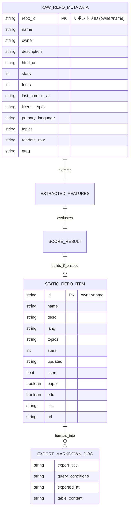

# データ構造・状態設計書（スキーマ・永続化・状態定義）
**ScholarRepo-Finder データモデル・スコアリング定義・静的データ＆Markdownスキーマ**

| 項目 | 内容 |
| :--- | :--- |
| 文書番号 | SRF-DS-001 |
| ドキュメント名 | 学術研究・アルゴリズム検証用OSS特化型検索モジュール データ構造仕様書 |
| 版数 | Rev.1.2 (Markdownエクスポートフォーマット仕様追加) |
| 改訂日 | 2026-08-31 |
| 作成日 | 2026-08-31 |
| 作成者 | ScholarRepo-Finder 開発チーム |

---

## 1. 概要とデータ管理方針

### 1.1 管理対象データの目的
本設計書は、ScholarRepo-Finderにおける以下のデータ構造および出力フォーマット仕様を規定する：
1. **収集メタデータ (Raw Repository Metadata DAO)**
2. **抽出特徴量データ (Extracted Features DAO)**
3. **スコア評価結果 (Scoring Result State)**
4. **GitHub Pages 配信用・軽量静的データスキーマ (`data/repos.json`)**
5. **Markdown エクスポート出力フォーマット仕様 (`.md`)**

---

## 2. データ構造およびスキーマ定義 (Mermaid データモデル図)

### 2.1 エンティティ関係・データモデル構造 (Mermaid ER図)



---

## 3. スコアリングモデル仕様

### 3.1 ハードフィルター (Hard Filters) 条件

| # | 判定項目 | 除外条件 (Drop Rule) | 理由 |
| :- | :--- | :--- | :--- |
| 1 | **ライセンス欠如** | `license_spdx` が `null` または非OSS | 再利用性・学術検証不可 |
| 2 | **陳腐化** | `last_commit_at` が 5 年以上前 | 依存環境の再現性喪失 |
| 3 | **README極小** | `readme_raw` が 100 文字以下または不在 | ドキュメント欠如 |

### 3.2 スコア計算式

$$	ext{Total Score} = (	ext{Repo Structural Score} + 	ext{Repo Context Score}) 	imes 	ext{User Trust Multiplier}$$

- **Repo Structural Score (最大50点)**: ディレクトリ分離(+15)、科学計算・OR依存関係(+20)、CI設定(+15)
- **Repo Context Score (最大50点)**: DOI/arXivリンク(+30)、Papers with Code公式登録(+20)、学術キーワード(+10)
- **User Trust Multiplier (0.5x〜1.5x)**: 機関ドメイン(1.5x)、認証組織(1.3x)、熟練開発者(1.1x)、一般(1.0x)、課題量産(0.5x)
- **登録閾値**: $	ext{Total Score} \ge 60.0$

---

## 4. GitHub Pages 配信用・軽量静的データスキーマ

### 4.1 配信用 JSON スキーマ (`data/repos.json`)

```json
[
  {
    "id": "Mominyar/emergency-dispatch-simulation-system",
    "name": "emergency-dispatch-simulation-system",
    "desc": "A turn-based emergency response simulation system designed for algorithmic evaluation.",
    "lang": "C",
    "topics": ["simulation", "dispatch", "c-programming"],
    "stars": 12,
    "updated": "2024-05-12",
    "score": 85.5,
    "paper": true,
    "edu": true,
    "libs": [],
    "url": "https://github.com/Mominyar/emergency-dispatch-simulation-system"
  }
]
```

---

## 5. Markdown エクスポート仕様 (Export Format)

### 5.1 検索結果一括ダウンロード Markdown 仕様

```markdown
# ScholarRepo-Finder 検索結果エクスポート
- **検索クエリ**: `{{ query }}`
- **適用フィルター**: 言語: `{{ lang }}`, 最低スコア: `{{ min_score }}`, 論文必須: `{{ require_paper }}`
- **出力件数**: {{ count }} 件
- **出力日時**: {{ exported_at }}

| # | リポジトリ | 総合スコア | 言語 | 論文/DOI | 最終更新 | 概要 |
| :-: | :--- | :---: | :---: | :---: | :---: | :--- |
| 1 | [{{ id }}]({{ url }}) | **{{ score }}** | {{ lang }} | {{ paper_badge }} | {{ updated }} | {{ desc }} |

---
*Generated by [ScholarRepo-Finder](https://xzyozi.github.io/ScholarRepo-Finder/)*
```

### 5.2 個別リポジトリ引用コピー用 Markdown 仕様 (Single Item)

```markdown
- **[{{ name }}]({{ url }})** (Score: {{ score }}, Lang: {{ lang }})
  - 概要: {{ desc }}
  - 関連タグ: `{{ topics }}`
  - 学術リンク: {{ paper_url }}
```

---

## 6. 改訂履歴 (Change Log)

| 版数 | 改訂日 | 変更者 | 変更内容・変更理由 (Why) |
| :--- | :--- | :--- | :--- |
| Rev.1.0 | 2026-08-31 | ScholarRepo-Finder 開発チーム | 新規作成（初版制定） |
| Rev.1.1 | 2026-08-31 | ScholarRepo-Finder 開発チーム | GitHub Pages 向け軽量 JSON スキーマへの移行 |
| Rev.1.2 | 2026-08-31 | ScholarRepo-Finder 開発チーム | Markdown エクスポートフォーマット仕様（一括表形式・個別引用）の追加 |
