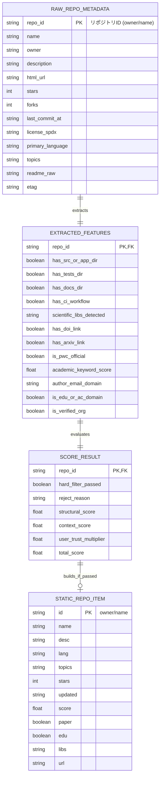

# データ構造・状態設計書（スキーマ・永続化・状態定義）
**ScholarRepo-Finder データモデル・スコアリング定義・静的データスキーマ**

| 項目 | 内容 |
| :--- | :--- |
| 文書番号 | SRF-DS-001 |
| ドキュメント名 | 学術研究・アルゴリズム検証用OSS特化型検索モジュール データ構造仕様書 |
| 版数 | Rev.1.1 (GitHub Pages軽量スキーマ対応) |
| 改訂日 | 2026-08-31 |
| 作成日 | 2026-08-31 |
| 作成者 | ScholarRepo-Finder 開発チーム |

---

## 1. 概要とデータ管理方針

### 1.1 管理対象データの目的
本設計書は、ScholarRepo-Finderにおける以下のデータ構造および評価モデル仕様を規定する：
1. **収集メタデータ (Raw Repository Metadata DAO)**
2. **抽出特徴量データ (Extracted Features DAO)**
3. **スコア評価結果 (Scoring Result State)**
4. **GitHub Pages 配信用・軽量静的データスキーマ (`data/repos.json`)**

### 1.2 データ量抑制・軽量化ポリシー
- **長文テキストの除外**: README 全文などの大容量テキストは配信 JSON から除外し、検索・表示に必要な最小メタデータ（リポジトリ名、説明、主要言語、トピック、スコア、論文リンク）のみを保持。
- **データサイズ目標**: 1リポジトリあたり **約 0.3〜0.5 KB**。1,000 件登録時でも総ファイルサイズは **約 300〜500 KB**（Gzip 圧縮時 **約 80 KB**）となり、ブラウザ側への瞬時読み込みを実現。

---

## 2. データ構造およびスキーマ定義 (Mermaid データモデル図)

### 2.1 エンティティ関係・データモデル構造 (Mermaid ER図)



---

## 3. スコアリングモデル仕様

### 3.1 ハードフィルター (Hard Filters) 条件

| # | 判定項目 | 除外条件 (Drop Rule) | 理由 |
| :- | :--- | :--- | :--- |
| 1 | **ライセンス欠如** | `license_spdx` が `null` または非OSS | 再利用性・学術検証不可 |
| 2 | **陳腐化** | `last_commit_at` が 5 年以上前 | 依存環境の再現性喪失 |
| 3 | **README極小** | `readme_raw` が 100 文字以下または不在 | ドキュメント欠如 |

### 3.2 スコア計算式

$$	ext{Total Score} = (	ext{Repo Structural Score} + 	ext{Repo Context Score}) 	imes 	ext{User Trust Multiplier}$$

#### ① Repo Structural Score (構造スコア) [最大 50点]
- **ディレクトリ分離度** (`src`, `tests`, `docs` 分離): +15点
- **科学計算・OR依存関係** (`numpy`, `scipy`, `simpy`, `networkx`, `ortools`, `pulp`, `ndarray` 等): +20点
- **自動テスト / CI** (GitHub Actions / Travis 等): +15点

#### ② Repo Context Score (文脈スコア) [最大 50点]
- **論文識別子** (DOI / arXiv リンク): +30点
- **Papers with Code 連携** (公式登録): +20点
- **学術キーワード頻度** ("benchmark", "reproduce" 等): +10点

#### ③ User Trust Multiplier (著者信頼度乗数) [0.5x 〜 1.5x]
- **教育・研究機関ドメイン** (`.edu`, `.ac.*`, `.gov`): **1.5x**
- **Verified Organization**: **1.3x**
- **一般熟練開発者**: **1.1x**
- **標準（新規・個人）**: **1.0x**
- **学習用量産アカウント**: **0.5x**

#### ④ 登録閾値
- $	ext{Total Score} \ge 60.0$ の優良リポジトリのみを静的データへ出力。

---

## 4. GitHub Pages 配信用・軽量静的データスキーマ

### 4.1 配信用 JSON スキーマ (`data/repos.json`)

軽量化のため、キー名を短縮・最適化した配列形式を採用：

| フィールド名 | データ型 | 説明 | 例 |
| :--- | :--- | :--- | :--- |
| `id` | 文字列 | リポジトリ識別子 (`owner/name`) | `"Mominyar/emergency-dispatch-sim"` |
| `name` | 文字列 | リポジトリ名 | `"emergency-dispatch-sim"` |
| `desc` | 文字列 | 概要文（最大200文字にトリム） | `"A turn-based emergency response simulation..."` |
| `lang` | 文字列 | 主要言語 | `"C"`, `"Python"`, `"Rust"` |
| `topics` | 文字列配列 | トピックタグ | `["simulation", "dispatch"]` |
| `stars` | 整数 | スター数 | `12` |
| `updated` | 文字列 | 最終コミット日 (`YYYY-MM-DD`) | `"2024-05-12"` |
| `score` | 浮動小数点 | 総合スコア ($\ge 60.0$) | `85.5` |
| `paper` | ブーリアン | 論文リンク有無 | `true` |
| `edu` | ブーリアン | アカデミック著者フラグ | `true` |
| `libs` | 文字列配列 | 検出された科学計算ライブラリ | `["simpy", "numpy"]` |
| `url` | 文字列 | リポジトリ URL | `"https://github.com/..."` |

### 4.2 サンプル JSON ドキュメント

```json
[
  {
    "id": "Mominyar/emergency-dispatch-simulation-system",
    "name": "emergency-dispatch-simulation-system",
    "desc": "A turn-based emergency response simulation system designed for algorithmic evaluation.",
    "lang": "C",
    "topics": ["simulation", "dispatch", "c-programming"],
    "stars": 12,
    "updated": "2024-05-12",
    "score": 85.5,
    "paper": true,
    "edu": true,
    "libs": [],
    "url": "https://github.com/Mominyar/emergency-dispatch-simulation-system"
  }
]
```

---

## 5. 改訂履歴 (Change Log)

| 版数 | 改訂日 | 変更者 | 変更内容・変更理由 (Why) |
| :--- | :--- | :--- | :--- |
| Rev.1.0 | 2026-08-31 | ScholarRepo-Finder 開発チーム | 新規作成（初版制定） |
| Rev.1.1 | 2026-08-31 | ScholarRepo-Finder 開発チーム | GitHub Pages 向け軽量 JSON スキーマへの移行・データ量抑制仕様追加 |
