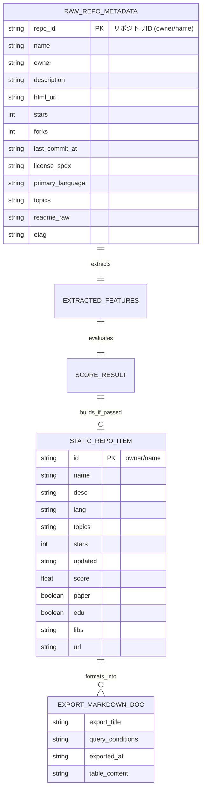

# データ構造・状態設計書（スキーマ・永続化・状態定義）
**ScholarRepo-Finder データモデル・スコアリング定義・静的データ＆Markdownスキーマ**

| 項目           | 内容                                                                 |
| :------------- | :------------------------------------------------------------------- |
| 文書番号       | SRF-DS-001                                                           |
| ドキュメント名 | 学術研究・アルゴリズム検証用OSS特化型検索モジュール データ構造仕様書 |
| 版数           | Rev.1.2 (Markdownエクスポートフォーマット仕様追加)                   |
| 改訂日         | 2026-08-31                                                           |
| 作成日         | 2026-08-31                                                           |
| 作成者         | ScholarRepo-Finder 開発チーム                                        |

---

## 1. 概要とデータ管理方針

### 1.1 管理対象データの目的
本設計書は、ScholarRepo-Finderにおける以下のデータ構造および出力フォーマット仕様を規定する：
1. **収集メタデータ (Raw Repository Metadata DAO)**
2. **抽出特徴量データ (Extracted Features DAO)**
3. **スコア評価結果 (Scoring Result State)**
4. **GitHub Pages 配信用・軽量静的データスキーマ (`data/repos.json`)**
5. **Markdown エクスポート出力フォーマット仕様 (`.md`)**

---

## 2. データ構造およびスキーマ定義 (Mermaid データモデル図)

### 2.1 エンティティ関係・データモデル構造 (Mermaid ER図)



---

## 3. スコアリングモデル仕様

### 3.1 ハードフィルター (Hard Filters) 条件

| #    | 判定項目           | 除外条件 (Drop Rule)                   | 理由                   |
| :--- | :----------------- | :------------------------------------- | :--------------------- |
| 1    | **ライセンス欠如** | `license_spdx` が `null` または非OSS   | 再利用性・学術検証不可 |
| 2    | **陳腐化**         | `last_commit_at` が 5 年以上前         | 依存環境の再現性喪失   |
| 3    | **README極小**     | `readme_raw` が 100 文字未満または不在 | ドキュメント欠如       |

### 3.2 設定駆動スコア計算式

$$\text{Total Score} = (\text{Reusability Score} + \text{Maintainability Score} + \text{Research Context Score}) \times \text{User Trust Multiplier}$$

配点、各評価軸の上限、ハードフィルター、掲載閾値、信頼度乗数は `config/scoring.toml` を唯一の設定源とする。設定ファイルの完全なスキーマ、既定プロファイル、および検証規則は [SRF-SC-001 スコアリング設定仕様書](./SRF-SC-001_スコアリング設定仕様書.md) を正とする。

| 評価軸   | 初期上限 | 主な根拠                                                 |
| :------- | -------: | :------------------------------------------------------- |
| 再利用性 |       30 | 提供形態、公開API、モジュール分割、利用手順、設定可能I/O |
| 保守性   |       20 | ソース・テスト・文書の分離、CI                           |
| 研究文脈 |       50 | DOI/arXivなどの論文リンク、学術キーワード                |

科学計算・MLライブラリおよびPapers with Codeは検索・表示用属性であり、直接加点しない。各評価軸は設定された上限で上限化し、ハードフィルター通過時のみ信頼度乗数を適用する。掲載可否は設定された閾値以上（`>=`）で判定する。

### 3.3 評価設定と結果データ

評価実行時に、設定の `profile.id`、`profile.version`、設定ファイルのSHA-256、各評価軸の内訳、適用した掲載閾値を記録する。不正な設定、未知キー、必須キー欠落、または上限・数値範囲違反は評価開始前のエラーとし、既定値への暗黙フォールバックは禁止する。

`ScoreResult` は将来の実装で、再利用性・保守性・研究文脈の各スコアと設定識別子を保持する。`StaticRepoItem` は検索・説明に必要な提供形態、再利用性根拠、スコア内訳を追加できるが、設定ハッシュなどの実行管理情報は観測レポートに限定する。

---

## 4. GitHub Pages 配信用・軽量静的データスキーマ

### 4.1 配信用 JSON スキーマ (`data/repos.json`)

```json
[
  {
    "id": "Mominyar/emergency-dispatch-simulation-system",
    "name": "emergency-dispatch-simulation-system",
    "desc": "A turn-based emergency response simulation system designed for algorithmic evaluation.",
    "lang": "C",
    "topics": ["simulation", "dispatch", "c-programming"],
    "stars": 12,
    "updated": "2024-05-12",
    "score": 85.5,
    "score_breakdown": {"reusability": 24.0, "maintainability": 20.0, "research_context": 13.0},
    "delivery_form": "modular_application",
    "reusability_evidence": ["c_cpp_header_implementation_pairs:3", "multiple_source_modules:3", "usage"],
    "paper": true,
    "edu": true,
    "libs": [],
    "url": "https://github.com/Mominyar/emergency-dispatch-simulation-system"
  }
]
```

---

## 5. Markdown エクスポート仕様 (Export Format)

### 5.1 検索結果一括ダウンロード Markdown 仕様

```markdown
# ScholarRepo-Finder 検索結果エクスポート
- **検索クエリ**: `{{ query }}`
- **適用フィルター**: 言語: `{{ lang }}`, 最低スコア: `{{ min_score }}`, 論文必須: `{{ require_paper }}`
- **出力件数**: {{ count }} 件
- **出力日時**: {{ exported_at }}

|   #   | リポジトリ            |   総合スコア    |    言語    |     論文/DOI      |   最終更新    | 概要       |
| :---: | :-------------------- | :-------------: | :--------: | :---------------: | :-----------: | :--------- |
|   1   | [{{ id }}]({{ url }}) | **{{ score }}** | {{ lang }} | {{ paper_badge }} | {{ updated }} | {{ desc }} |

---
*Generated by [ScholarRepo-Finder](https://xzyozi.github.io/ScholarRepo-Finder/)*
```

### 5.2 個別リポジトリ引用コピー用 Markdown 仕様 (Single Item)

```markdown
- **[{{ name }}]({{ url }})** (Score: {{ score }}, Lang: {{ lang }})
  - 概要: {{ desc }}
  - 関連タグ: `{{ topics }}`
  - 学術リンク: {{ paper_url }}
```

---

## 6. 改訂履歴 (Change Log)

| 版数    | 改訂日     | 変更者                        | 変更内容・変更理由 (Why)                                            |
| :------ | :--------- | :---------------------------- | :------------------------------------------------------------------ |
| Rev.1.0 | 2026-08-31 | ScholarRepo-Finder 開発チーム | 新規作成（初版制定）                                                |
| Rev.1.1 | 2026-08-31 | ScholarRepo-Finder 開発チーム | GitHub Pages 向け軽量 JSON スキーマへの移行                         |
| Rev.1.2 | 2026-08-31 | ScholarRepo-Finder 開発チーム | Markdown エクスポートフォーマット仕様（一括表形式・個別引用）の追加 |
