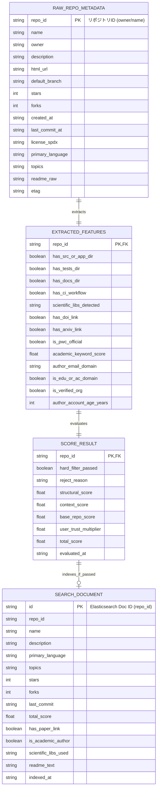

# データ構造・状態設計書（スキーマ・永続化・状態定義）
**ScholarRepo-Finder データモデル・スコアリング定義・インデックススキーマ**

| 項目 | 内容 |
| :--- | :--- |
| 文書番号 | SRF-DS-001 |
| ドキュメント名 | 学術研究・アルゴリズム検証用OSS特化型検索モジュール データ構造仕様書 |
| 版数 | Rev.1.0 (新規作成) |
| 改訂日 | 2026-08-31 |
| 作成日 | 2026-08-31 |
| 作成者 | ScholarRepo-Finder 開発チーム |

---

## 1. 概要とデータ管理方針

### 1.1 管理対象データの目的
本設計書は、ScholarRepo-Finderにおいて物理保存・永続化される以下のデータ構造および評価モデル仕様を規定する：
1. **リポジトリ生メタデータ (Raw Repository Metadata DAO)**
2. **抽出特徴量データ (Extracted Features DAO)**
3. **スコア評価結果 (Scoring Result State)**
4. **検索インデックスドキュメント (Elasticsearch Document Schema)**

### 1.2 データ境界 (DAO / 永続化ストレージ正本)
- **データアクセス・永続化正本 (DAO / State)**: 本書は Elasticsearch インデックスおよびストレージ/キャッシュに物理保存されるデータ構造の正本とする。
- **DTOとの使い分け**: モジュール間パッシング用のメモリ内 DTO については [SRF-DD-001_詳細設計書.md](./SRF-DD-001_詳細設計書.md) を参照すること。

---

## 2. データ構造およびスキーマ定義 (Mermaid データモデル図)

### 2.1 エンティティ関係・データモデル構造 (Mermaid ER図)

### 2.2 データモデル・フィールド仕様

#### ① 生メタデータ (RAW_REPO_METADATA)

| フィールド名 | データ型 | 必須性 | デフォルト値 | 制約・説明 |
| :--- | :--- | :---: | :--- | :--- |
| `repo_id` | 文字列 | 必須 | なし | 主キー。`owner/repo` 形式 |
| `name` | 文字列 | 必須 | なし | リポジトリ名 |
| `owner` | 文字列 | 必須 | なし | 所有者アカウント名 |
| `description` | 文字列 | 任意 | `null` | リポジトリ概要説明文 |
| `html_url` | 文字列 | 必須 | なし | GitHub リポジトリ URL |
| `stars` | 整数 | 必須 | `0` | スター数 ($\ge 0$) |
| `forks` | 整数 | 必須 | `0` | フォーク数 ($\ge 0$) |
| `last_commit_at` | 日時文字列 | 必須 | なし | 最終コミット日時 (ISO 8601) |
| `license_spdx` | 文字列 | 任意 | `null` | SPDX ライセンス識別子 (例: `MIT`, `Apache-2.0`) |
| `primary_language` | 文字列 | 任意 | `null` | 主要プログラミング言語 |
| `topics` | 文字列配列 | 必須 | `[]` | GitHub Topics タグ一覧 |
| `readme_raw` | 文字列 | 任意 | `null` | README の生テキスト |
| `etag` | 文字列 | 任意 | `null` | GitHub API 条件付きリクエスト用 ETag |

---

## 3. スコアリングモデル仕様

### 3.1 ハードフィルター (Hard Filters) 条件
以下のいずれかに該当するリポジトリは即座に除外（Drop）される。

| # | 判定項目 | 除外条件 (Drop Rule) | 理由 |
| :- | :--- | :--- | :--- |
| 1 | **ライセンス欠如** | `license_spdx` が `null` または非OSS | 再利用性・学術検証不可 |
| 2 | **陳腐化** | `last_commit_at` が 5 年以上前 | 依存環境の再現性喪失 |
| 3 | **README極小** | `readme_raw` が 100 文字以下または不在 | ドキュメント欠如 |

### 3.2 スコア計算式

$$	ext{Total Score} = (	ext{Repo Structural Score} + 	ext{Repo Context Score}) 	imes 	ext{User Trust Multiplier}$$

#### ① Repo Structural Score (構造スコア) [最大 50点]

| 評価項目 | 判定基準・条件 | 加点 |
| :--- | :--- | :---: |
| **ディレクトリ分離度** | `src/` (または `app/`), `tests/`, `docs/` が論理的に分離 | +15点 |
| **科学計算・OR依存関係** | `numpy`, `scipy`, `simpy`, `networkx`, `ortools`, `pulp`, `ndarray` 等の検出 | +20点 |
| **自動テスト / CI** | GitHub Actions (`.github/workflows/`), Travis CI 等の設定ファイル存在 | +15点 |

#### ② Repo Context Score (文脈スコア) [最大 50点]

| 評価項目 | 判定基準・条件 | 加点 |
| :--- | :--- | :---: |
| **論文識別子 (DOI / arXiv)** | `doi.org/...` または `arxiv.org/abs/...` のリンク存在 | +30点 |
| **Papers with Code 連携** | Papers with Code 公式リポジトリリストに登録済み | +20点 |
| **学術キーワード頻度** | "benchmark", "baseline", "reproduce", "dataset" 等のTF-IDF高スコア | +10点 |

#### ③ User Trust Multiplier (著者信頼度乗数) [0.5x 〜 1.5x]

| 著者属性・条件 | 乗数 | 理由・意図 |
| :--- | :---: | :--- |
| **教育・研究機関ドメイン** | **1.5x** | `.edu`, `.ac.*`, `.gov` ドメインメール保有研究者 |
| **Verified Organization** | **1.3x** | 大学研究所・学会等の認証組織 |
| **一般熟練開発者** | **1.1x** | アカウント歴3年以上かつ安定したコミット実績 |
| **標準（新規・個人）** | **1.0x** | 減点せず、リポジトリ自体の品質スコアのみで公平評価 |
| **学習用量産アカウント** | **0.5x** | カリキュラム課題（The Odin Project等）の量産ノイズ回避 |

#### ④ 登録閾値
- $	ext{Total Score} \ge 60.0$ のリポジトリのみを Elasticsearch に永続化。

---

## 4. Elasticsearch インデックススキーマ仕様

### 4.1 Index Name: `scholar_repos_v1`

| フィールド名 | ES型 | 属性・アナライザー | 用途 |
| :--- | :--- | :--- | :--- |
| `repo_id` | `keyword` | - | 一意ドキュメント識別子 |
| `name` | `text` | multi-field (`keyword`) | リポジトリ名検索・完全一致 |
| `owner` | `keyword` | - | 所有者での絞り込み |
| `description` | `text` | `standard` | 概要文の全文検索 |
| `primary_language` | `keyword` | - | 言語ファセット絞り込み |
| `topics` | `keyword` | - | トピックタグ絞り込み |
| `metrics.stars` | `integer` | - | スター数範囲検索・ソート |
| `metrics.forks` | `integer` | - | フォーク数 |
| `metrics.last_commit` | `date` | - | 最終更新日時ソート |
| `research_metadata.total_score` | `float` | - | 総合スコア（デフォルトソートキー） |
| `research_metadata.structural_score` | `float` | - | 構造品質スコア |
| `research_metadata.context_score` | `float` | - | 学術文脈スコア |
| `research_metadata.user_trust_multiplier` | `float` | - | 著者信頼度乗数 |
| `research_metadata.has_paper_link` | `boolean` | - | 論文リンク有無フィルタ |
| `research_metadata.is_academic_author` | `boolean` | - | アカデミック著者フラグ |
| `research_metadata.scientific_libs_used` | `keyword` | - | 使用科学計算ライブラリファセット |
| `readme_text` | `text` | `standard` | README 全文検索 (BM25) |
| `indexed_at` | `date` | - | インデックス登録日時 |

---

## 5. 改訂履歴 (Change Log)

| 版数 | 改訂日 | 変更者 | 変更内容・変更理由 (Why) |
| :--- | :--- | :--- | :--- |
| Rev.1.0 | 2026-08-31 | ScholarRepo-Finder 開発チーム | 新規作成（初版制定） |
