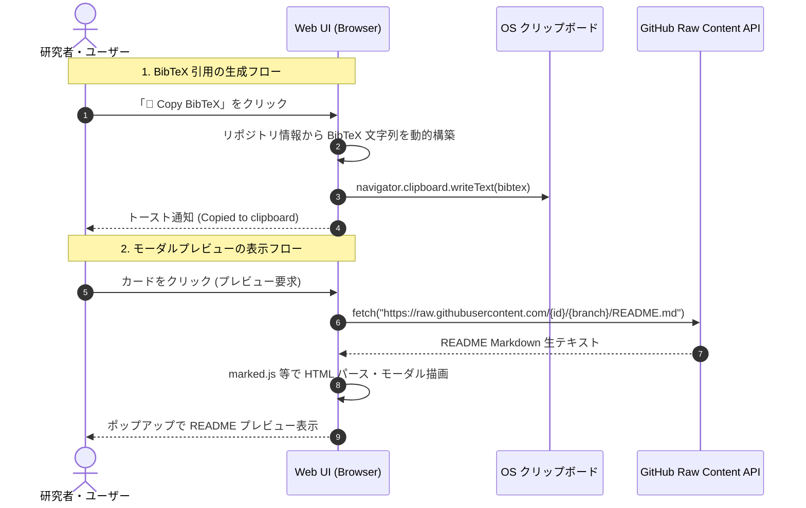

# [FEAT] BibTeX引用ワンクリック生成 ＆ READMEモーダルプレビュー機能 検討書

- **文書番号**: SRF-FEAT-002
- **作成日**: 2026-08-31
- **ステータス**: 設計・検討中 (Proposed)
- **対象**: Web UI (`public/app.js`, `public/index.html`), データモデル (`src/scholarrepo_finder/models.py`)

---

## 1. 提案の背景・目的 (Background & Motivation)

### 1.1 課題
ScholarRepo-Finder を利用するコアユーザー（大学・企業の研究者、データサイエンティスト、大学院生）は、探索した優良 OSS を以下の目的で活用します：
1. **学術論文（LaTeX / Overleaf）での関連研究（Related Work）引用**:
   - 既存の Markdown コピーだけでは、LaTeX 論文執筆時に手動で BibTeX 形式へ変換・成形する手間が発生する。
2. **高速な中身の確認（一次スクリーニング）**:
   - リポジトリのカードを見た後、毎回 GitHub の別タブを開いて README を確認するのはブラウザのタブが氾濫し、探索効率が低下する。

### 1.2 目的
- **「📜 BibTeX」ボタン** を各カードに追加し、論文執筆にそのまま使える `@misc{...}` / `@software{...}` 形式の引用テキストをワンクリックでクリップボードへコピー可能にする。
- カードをクリックした際に、**画面遷移なしで README やアルゴリズム概要を閲覧できる「モーダルプレビュー（Modal Preview）」** を提供し、シームレスな探索体験を実現する。

---

## 2. 機能要件 (Functional Requirements)

### 2.1 BibTeX 引用自動生成機能
1. **フォーマット仕様**:
   GitHub リポジトリの所有者、リポジトリ名、更新年、URL、概要文から標準的な `@misc` または `@software` エントリを動的に生成する。

   ```bibtex
   @misc{author2024repo,
     author       = {Author/Organization Name},
     title        = {{Repository Name}: Description of the repository},
     year         = {2024},
     publisher    = {GitHub},
     journal      = {GitHub repository},
     howpublished = {\url{https://github.com/owner/repo}},
     note         = {ScholarRepo-Finder Quality Score: 112.5}
   }
   ```

2. **UI/UX 操作**:
   - 各カードのフッターに `📜 Copy BibTeX` ボタンを配置。
   - クリック時にクリップボードへコピーし、「BibTeX 引用をコピーしました」とトースト通知を表示。

---

### 2.2 README モーダルプレビュー機能
1. **プレビュー表示**:
   - カードのタイトルまたは「🔍 Preview」ボタンをクリックすると、画面中央にモーダルウィンドウがポップアップ表示される。
   - モーダル内には、リポジトリのメタデータ（スター数、ライセンス、スコア内訳、検出ライブラリ）および README テキスト（Markdown レンダリングまたは整形テキスト）が表示される。
2. **軽量化の維持**:
   - 静的配信 JSON の肥大化を防ぐため、`public/data/repos.json` には README の冒頭要約（最大 1,000 文字程度）を含めるか、プレビュー時に GitHub Raw URL (`https://raw.githubusercontent.com/.../README.md`) からオンデマンドで取得・描画する設計を採用する。

---

## 3. アーキテクチャ ＆ 実装方針 (Technical Design)



---

## 4. 今後のロードマップ (Implementation Tasks)

1. **Phase 1 (BibTeX 生成)**:
   - `public/app.js` に `copyItemBibTeX(repoId)` 関数を追加。
   - 日英 i18n 辞書に BibTeX 関連ラベルを追加。
2. **Phase 2 (README モーダル)**:
   - `public/index.html` にモーダル用コンテナを追加。
   - CDN から軽量 Markdown パーサー（`marked.js` など）を導入し、GitHub Raw からの非同期オンデマンド取得ロジックを実装。
